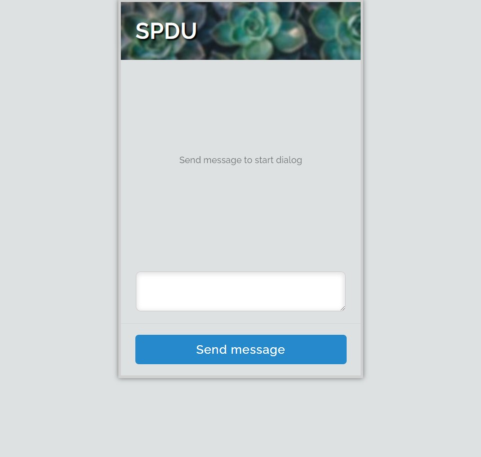
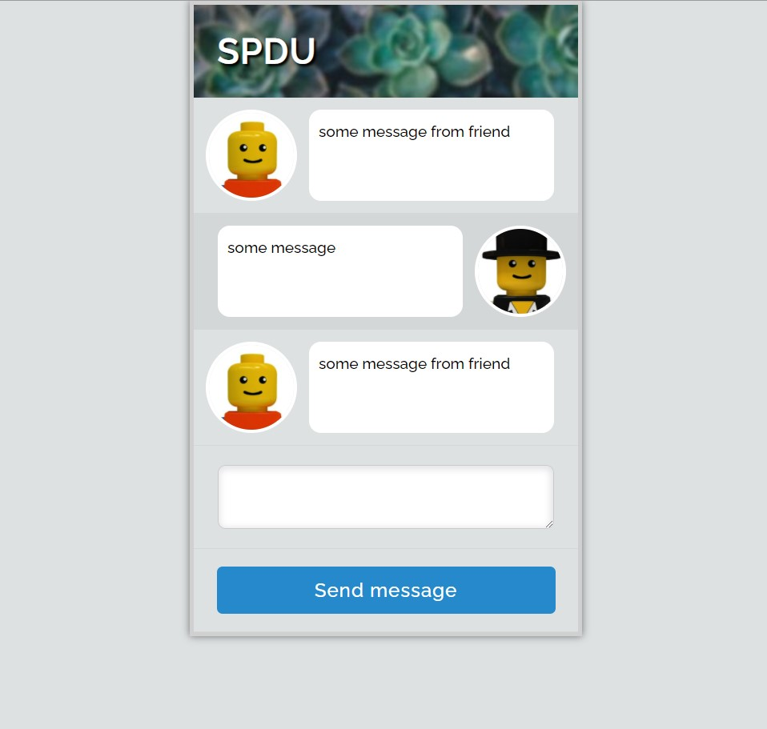
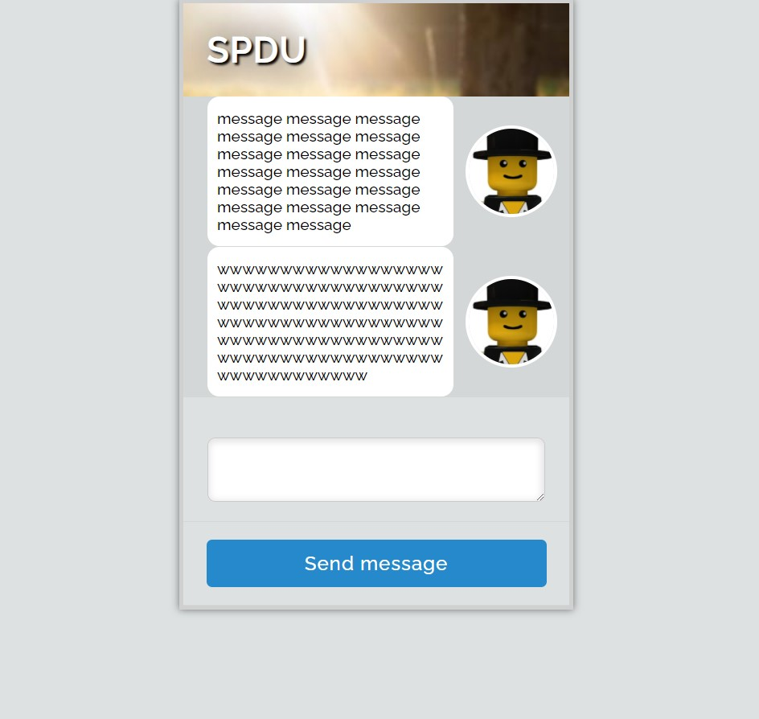
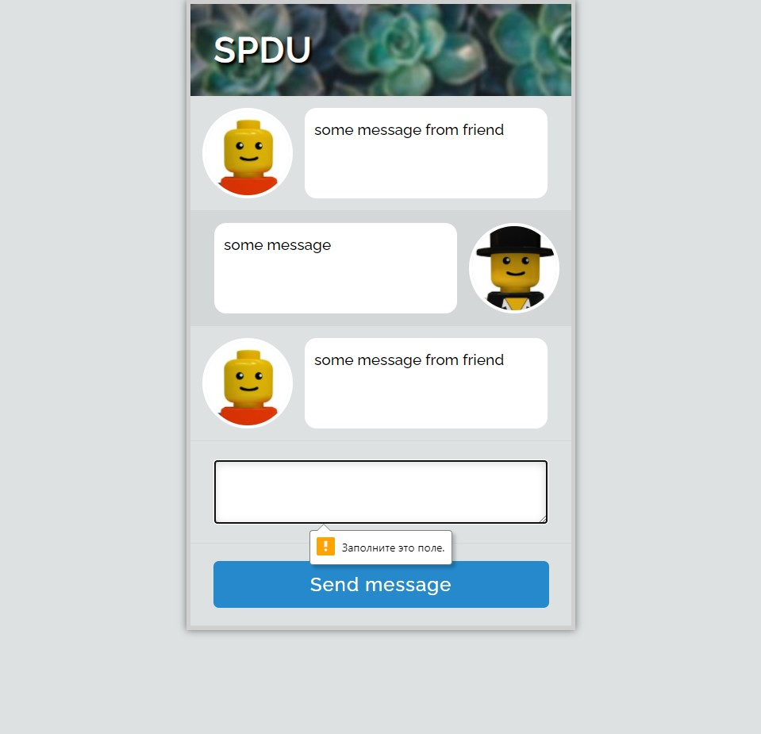

# Chat Dialog UI

My implementation is done withouth back-end integration and store messages only in browser's local storage.

## How to send message behalf of friend
To emulate recieving message from the friend, it's necessary to run JS function in browser's console: ```sendMessageAsFriend();```

## Screenshots

### Chat without messaages


### Chat with messages


### Chat with long messages


### Chat with validation error when the message is empty



